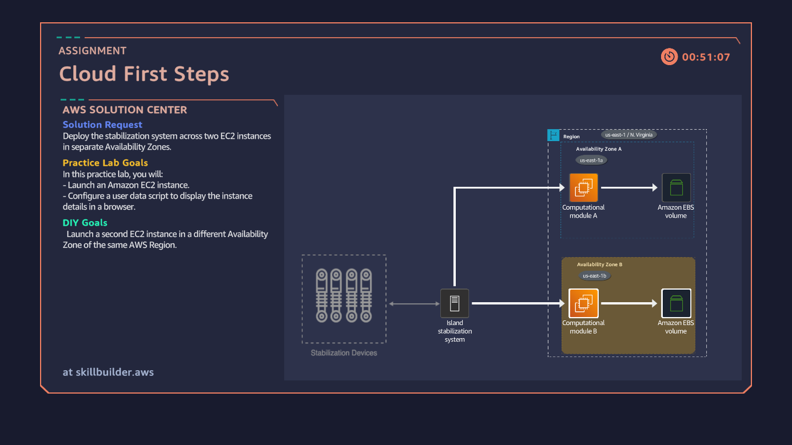
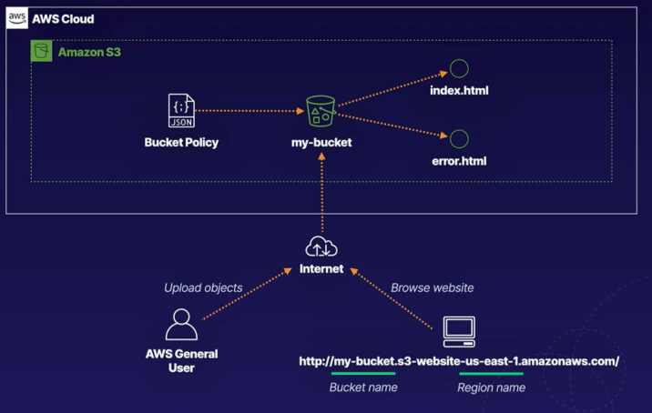
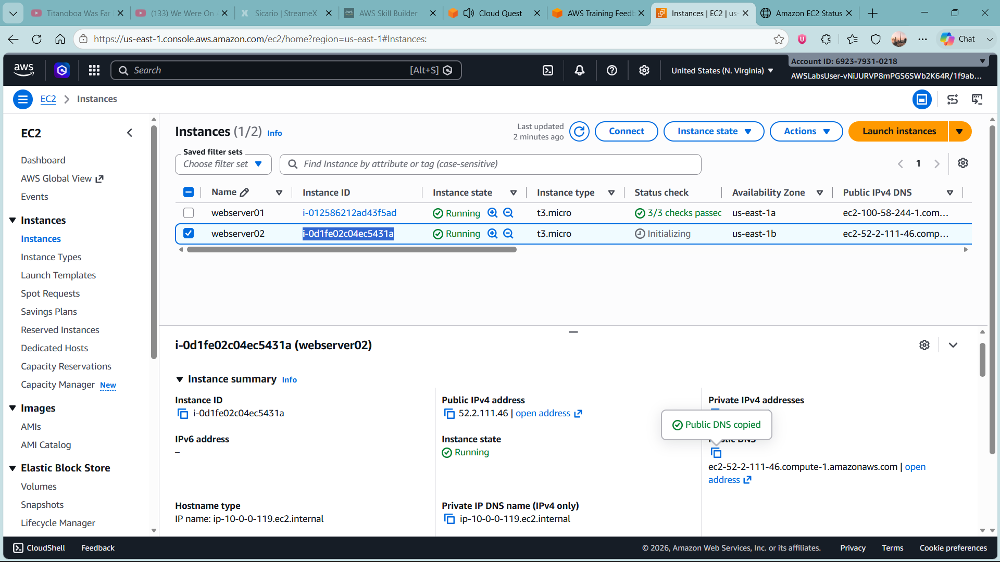
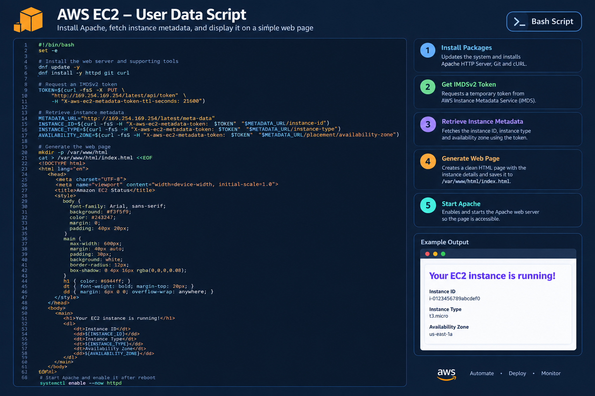

# aws-web-hosting-automation
A hands-on AWS project covering S3 static website hosting, EC2 user data scripts, Linux web server deployment, instance metadata, and cloud infrastructure concepts.

# AWS Web Hosting and Automation Lab

## Project Overview

This project documents two hands-on AWS exercises involving static website hosting and automated web server deployment.

The first exercise enables static website hosting on an Amazon S3 bucket and reviews its website configuration and permissions.

The second exercise uses Amazon EC2 user data to automate the setup of an Apache web server on Amazon Linux. A Bash script retrieves instance metadata and generates an HTML page displaying the instance ID, instance type, and Availability Zone.

Together, these exercises demonstrate foundational cloud computing, web hosting, Linux administration, scripting, and infrastructure automation skills.

## Objectives

* Enable static website hosting on an Amazon S3 bucket.
* Configure index and error documents.
* Review S3 bucket permissions and hosting-related access requirements.
* Launch an Amazon EC2 instance using Amazon Linux.
* Configure EC2 user data to automate web server installation.
* Retrieve instance details using the EC2 Instance Metadata Service.
* Generate an HTML status page dynamically.
* Understand the role of Availability Zones in cloud infrastructure design.

## Technologies Used

| Technology                                | Purpose                                                |
| ----------------------------------------- | ------------------------------------------------------ |
| Amazon S3                                 | Hosts static website files.                            |
| Amazon EC2                                | Runs a Linux-based web server.                         |
| Amazon Linux 2023                         | Provides the operating system for the EC2 instance.    |
| Bash                                      | Automates server setup and page generation.            |
| Apache HTTP Server                        | Serves the generated HTML page over HTTP.              |
| EC2 Instance Metadata Service v2 (IMDSv2) | Supplies instance-specific metadata.                   |
| Amazon VPC                                | Provides the network environment for the EC2 instance. |
| EC2 Security Groups                       | Controls access to the web server.                     |

# Exercise 1: Amazon S3 Static Website Hosting

## Objective

Enable static website hosting on an existing S3 bucket and review its configuration and permissions.

## Implementation

1. Opened the Amazon S3 console and located the lab website bucket.
2. Renamed the designated HTML error page to `error.html`.
3. Reviewed the bucket's permissions.
4. Opened the bucket properties and enabled static website hosting.
5. Selected the option to host a static website.
6. Configured `index.html` as the index document.
7. Configured `error.html` as the error document.
8. Saved the configuration and checked that the hosting type displayed as bucket hosting.

## Key Concepts

**Index document:** The default document returned for the website's root path.

**Error document:** The page displayed for certain website errors, such as missing content.

**Bucket permissions:** Access controls determine who can read or modify bucket contents. Static website hosting configuration does not automatically make the website publicly accessible.

**Security consideration:** S3 website endpoints use HTTP. For HTTPS, a common production approach is to use Amazon CloudFront with an S3 origin and appropriate access controls.

# Exercise 2: Automated EC2 Web Server Deployment

## Objective

Launch an Amazon EC2 instance and use a Bash user data script to install Apache and generate a web page containing instance metadata.

## Instance Configuration

| Setting                      | Value             |
| ---------------------------- | ----------------- |
| Instance name                | `webserver01`     |
| Operating system             | Amazon Linux 2023 |
| Instance type                | `t3.micro`        |
| VPC                          | Lab VPC           |
| Subnet                       | Public subnet 1   |
| Security group               | `Lab-SG`          |
| Inbound application protocol | HTTP              |
| Application port             | TCP 80            |

The lab instructions used an existing VPC and public subnet. The instance was configured with an HTTP security group rule.

## Automation Workflow

1. Retrieved the provided user data script from the lab's S3 resources.
2. Opened the EC2 launch instance wizard.
3. Selected Amazon Linux 2023 and the `t3.micro` instance type.
4. Selected the lab VPC and designated public subnet.
5. Configured the security group for HTTP access.
6. Uploaded the Bash script under the advanced user data settings.
7. Launched the instance and reviewed the instance list.

## What the Script Does

* Updates installed packages.
* Installs Apache HTTP Server and Git.
* Requests an IMDSv2 session token.
* Retrieves the EC2 instance ID, instance type, and Availability Zone.
* Generates an HTML status page containing those values.
* Starts the Apache web server.

The generated page helps identify which EC2 instance is responding to a browser request.

## Skills Demonstrated

### Cloud Infrastructure

* Amazon S3 static website configuration.
* Amazon EC2 instance provisioning.
* Understanding VPCs, subnets, and Availability Zones.
* Configuring application access through security groups.

### Linux Administration

* Using Bash to automate server configuration.
* Installing software packages on Amazon Linux.
* Managing the Apache HTTP service.
* Creating files and generating HTML from a script.

### Cloud Automation

* Configuring EC2 user data.
* Retrieving metadata through IMDSv2.
* Building instance-specific status pages.
* Reducing manual setup during instance deployment.

### Security Awareness

* Reviewing S3 bucket permissions.
* Understanding the risks of publicly accessible storage.
* Applying security group rules for web traffic.
* Understanding why public web access should be restricted to required ports and services.

## Validation

The following checks can be used to verify the deployment:

* Confirm that S3 static website hosting is enabled.
* Confirm the configured index and error document names.
* Confirm that the EC2 instance reaches the running state.
* Review the EC2 system log or cloud-init logs if user data fails.
* Test the web server through its public IPv4 address using HTTP.
* Verify that the browser displays the expected instance metadata.

Actual validation results should be recorded after testing.

## Learning Outcomes

This lab demonstrates how cloud services can host static content and automate the deployment of a web server.

It also highlights how instance metadata can provide useful operational information without hardcoding instance identifiers into the page.

The exercises provide a foundation for exploring load balancing, multi-Availability Zone deployments, automated scaling, HTTPS, and infrastructure as code.

## Future Improvements

* Deploy two EC2 instances in separate Availability Zones.
* Add an Application Load Balancer to distribute requests.
* Configure Auto Scaling for automated capacity management.
* Add CloudWatch monitoring and health checks.
* Serve the S3 website through CloudFront with HTTPS.
* Improve the bootstrap script with logging and error handling.
* Use an IAM instance profile for AWS API access when required.
* Provision the environment with AWS CloudFormation or Terraform.

